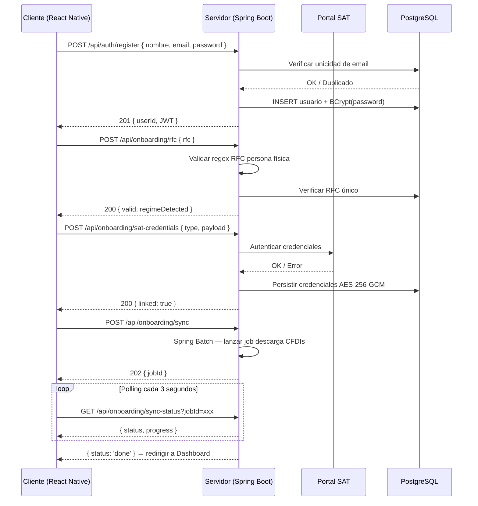

# SRS — Módulo de Onboarding
### FiskalApp | Software Requirements Specification
> **Documento técnico complementario a TECH_SPEC.md — v1.0 | Marzo 2026**

Esta sección especifica los requerimientos de software del flujo de onboarding. El onboarding es el punto de entrada de cada usuario a FiskalApp y comprende desde el registro inicial hasta la visualización del primer balance fiscal personalizado.

---

## 1. Cliente (React Native)

### 1.1 Casos de Uso

| ID | Caso de uso | Descripción |
|---|---|---|
| CU-01 | Registro de cuenta | El usuario crea una cuenta nueva ingresando nombre, correo electrónico y contraseña. |
| CU-02 | Ingreso de RFC | El usuario escribe su RFC y la app lo valida en formato y longitud antes de enviarlo al servidor. |
| CU-03 | Vinculación con el SAT | El usuario ingresa su contraseña del SAT o sube su e.firma (.cer + .key) para autorizar la descarga de CFDIs. |
| CU-04 | Selección de régimen fiscal | El usuario selecciona su régimen o acepta la detección automática sugerida por el servidor. |
| CU-05 | Importación inicial de CFDIs | La app descarga las facturas del período actual desde el SAT y muestra el progreso al usuario. |
| CU-06 | Presentación de dashboard | Al completar el onboarding, el usuario visualiza su balance fiscal inicial y un resumen de obligaciones próximas. |

### 1.2 Requerimientos Funcionales

| ID | Requerimiento |
|---|---|
| RF-C01 | La pantalla de registro debe validar formato de correo electrónico antes de habilitar el botón de continuar. |
| RF-C02 | El campo de RFC debe validar longitud (12 caracteres persona moral, 13 persona física) y formato alfanumérico en tiempo real. |
| RF-C03 | El wizard de onboarding debe mostrar un indicador de progreso con los 5 pasos claramente identificados. |
| RF-C04 | La carga de e.firma debe soportar archivos .cer y .key desde el almacenamiento local del dispositivo. |
| RF-C05 | Durante la importación de CFDIs, la pantalla debe mostrar una barra de progreso con el porcentaje de facturas descargadas. |
| RF-C06 | El usuario debe poder omitir la vinculación con el SAT y completarla posteriormente desde configuración. |
| RF-C07 | Todos los campos de contraseña deben tener opción de mostrar/ocultar texto. |
| RF-C08 | El onboarding debe completarse en un máximo de 5 pasos sin ramificaciones complejas visibles para el usuario. |

### 1.3 Requerimientos No Funcionales

| ID | Requerimiento |
|---|---|
| RNF-C01 | Cada pantalla del wizard debe cargar en menos de 1 segundo en conexión 4G. |
| RNF-C02 | La app debe funcionar en iOS 15+ y Android 10+ sin degradación de experiencia. |
| RNF-C03 | Las credenciales del SAT nunca deben almacenarse en texto plano en el dispositivo (Keychain en iOS, Keystore en Android). |
| RNF-C04 | El flujo debe ser accesible: soporte para tamaño de fuente dinámico y lectores de pantalla (VoiceOver / TalkBack). |
| RNF-C05 | Si el onboarding se interrumpe, la app debe reanudar desde el último paso completado al volver a abrir. |

### 1.4 Flujo de Onboarding — Cliente

```
INICIO
  │
  ├─► Pantalla de Bienvenida
  │       └─► [Crear cuenta] o [Iniciar sesión]
  │
  ├─► Paso 1: Registro (nombre, correo, contraseña)
  │       └─► Validación de correo único → POST /api/auth/register
  │
  ├─► Paso 2: Ingreso de RFC
  │       └─► Validación local → POST /api/onboarding/rfc
  │
  ├─► Paso 3: Vinculación SAT (contraseña o e.firma)
  │       ├─► Éxito → continuar Paso 4
  │       └─► Omitir → marcar pendiente, continuar Paso 4
  │
  ├─► Paso 4: Selección / confirmación de régimen fiscal
  │       └─► POST /api/onboarding/regime
  │
  ├─► Paso 5: Importación inicial de CFDIs
  │       └─► GET /api/onboarding/sync-status (polling)
  │
  └─► Dashboard principal (balance fiscal + próximas obligaciones)
```

---

## 2. Servidor (Spring Boot 3 / Java 21)

### 2.1 Casos de Uso

| ID | Caso de uso | Descripción |
|---|---|---|
| CU-S01 | Registro de usuario | El servidor crea el registro, hashea la contraseña con BCrypt y devuelve un JWT de sesión. |
| CU-S02 | Validación de RFC | Verifica el formato del RFC contra las reglas del SAT y consulta si ya existe en el sistema. |
| CU-S03 | Autenticación con el SAT | Recibe las credenciales cifradas del SAT, las valida y las almacena con AES-256. |
| CU-S04 | Detección de régimen fiscal | Con base en el RFC vinculado al SAT, detecta el régimen del contribuyente y lo sugiere al cliente. |
| CU-S05 | Sincronización de CFDIs | Ejecuta un job de Spring Batch para descargar el historial de CFDIs del SAT e indexarlos en BD. |
| CU-S06 | Estado de onboarding | Expone el estado actual del onboarding para que el cliente pueda reanudarlo tras una interrupción. |

### 2.2 Endpoints REST

| Método + Ruta | Request | Response |
|---|---|---|
| `POST /api/auth/register` | `{ nombre, email, password }` | `201: { userId, token }` / `409: email duplicado` |
| `POST /api/auth/login` | `{ email, password }` | `200: { token, refreshToken }` / `401: credenciales inválidas` |
| `POST /api/onboarding/rfc` | `{ rfc }` | `200: { valid: true, regimeDetected }` / `422: formato inválido` |
| `POST /api/onboarding/sat-credentials` | `{ type: 'password'\|'efirma', payload: encrypted }` | `200: { linked: true }` / `401: SAT rechazó credenciales` |
| `POST /api/onboarding/regime` | `{ regimeCode: 'RESICO'\|'ACT_EMP'\|'HONORARIOS' }` | `200: { confirmed: true }` |
| `POST /api/onboarding/sync` | `{ periodoInicio, periodoFin }` | `202: { jobId }` (proceso asíncrono) |
| `GET /api/onboarding/sync-status` | `?jobId=xxx` | `200: { status: 'running'\|'done'\|'error', progress: 0-100, total, processed }` |
| `GET /api/onboarding/status` | — | `200: { currentStep: 1-5, completed: bool }` |

### 2.3 Validaciones y Reglas de Negocio

| ID | Regla | Detalle |
|---|---|---|
| RB-S01 | Unicidad de correo | Email único en BD. Validación previa al INSERT con índice único en columna `email`. |
| RB-S02 | Formato de RFC | Persona física: `^[A-Z]{4}\d{6}[A-Z0-9]{3}$` |
| RB-S03 | RFC único por cuenta | Un RFC solo puede estar vinculado a una cuenta activa. Error `409` si ya existe. |
| RB-S04 | Hash de contraseña | BCrypt con cost factor 12. Nunca en texto plano ni en logs. |
| RB-S05 | Cifrado de credenciales SAT | AES-256-GCM antes de persistir. Llave gestionada vía AWS KMS. |
| RB-S06 | Expiración de JWT | Access token: 15 min. Refresh token: 30 días, se invalida al cerrar sesión. |
| RB-S07 | Límite de reintentos SAT | 3 intentos fallidos = bloqueo temporal de 10 minutos para evitar bloqueos en el portal. |
| RB-S08 | Idempotencia del sync | Si hay un job activo para el usuario, retorna el `jobId` existente sin crear uno nuevo. |

### 2.4 Manejo de Errores

| Código HTTP | Escenario | Response |
|---|---|---|
| `400 Bad Request` | Campos faltantes o con formato incorrecto | `{ error: 'VALIDATION_ERROR', fields: [...] }` |
| `401 Unauthorized` | JWT inválido/expirado o credenciales SAT incorrectas | `{ error: 'AUTH_ERROR', message: '...' }` |
| `409 Conflict` | Email o RFC ya registrado | `{ error: 'DUPLICATE_RESOURCE', field: 'email'\|'rfc' }` |
| `422 Unprocessable Entity` | RFC con formato válido pero que no pasa validación SAT | `{ error: 'INVALID_RFC' }` |
| `429 Too Many Requests` | Superado límite de 3 intentos de vinculación SAT | `{ error: 'RATE_LIMITED', retryAfter: 600 }` |
| `502 Bad Gateway` | Error de comunicación con SAT o Facturama | `{ error: 'UPSTREAM_ERROR', service: 'SAT'\|'FACTURAMA' }` |
| `503 Service Unavailable` | Job de sincronización no disponible | `{ error: 'SYNC_UNAVAILABLE', retryAfter: 30 }` |

### 2.5 Flujo del Servidor — Sequence Diagram



---

*Documento confidencial — Uso exclusivo para inversionistas y stakeholders. FiskalApp © 2026*
