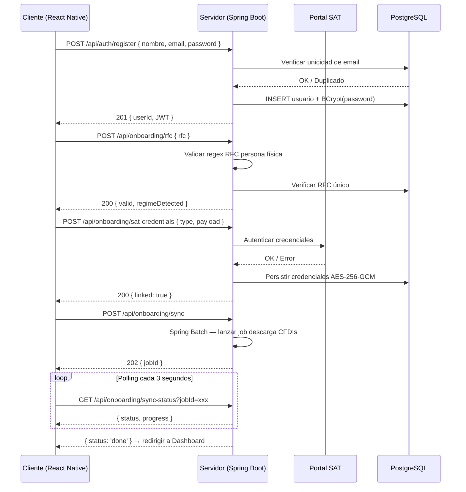

# FiskalApp
### Gestión fiscal inteligente para personas físicas en México
> **Tech Spec & Vision Document — v1.0 | Marzo 2026**

| Campo | Detalle |
|---|---|
| Tipo de documento | Especificación Técnica y Propuesta de Valor |
| Audiencia | Inversionistas y Stakeholders |
| Estado | Borrador — Versión inicial |
| Mercado objetivo | México — Personas Físicas con actividad empresarial |
| Plataforma | iOS & Android (aplicación móvil) |

---

## Tabla de Contenidos

1. [Resumen Ejecutivo](#1-resumen-ejecutivo)
2. [Descripción del Problema](#2-descripción-del-problema)
3. [Usuarios Objetivo](#3-usuarios-objetivo)
4. [Funcionalidades Principales](#4-funcionalidades-principales)
5. [Flujos de Usuario](#5-flujos-de-usuario-principales)
6. [Arquitectura Técnica](#6-arquitectura-técnica)
7. [Modelo de Negocio](#7-modelo-de-negocio)
8. [Roadmap de Desarrollo](#8-roadmap-de-desarrollo)
9. [Próximos Pasos](#9-próximos-pasos)
10. [SRS — Módulo de Onboarding](#10-srs--módulo-de-onboarding)

---

## 1. Resumen Ejecutivo

FiskalApp es una aplicación móvil diseñada para empoderar a personas físicas —comerciantes, contratistas, profesionistas independientes y freelancers— en México para gestionar su contabilidad fiscal de forma autónoma, sin depender de un contador externo.

La aplicación traduce la complejidad del sistema tributario mexicano (SAT) a un lenguaje claro y accesible, automatiza los procesos más repetitivos y reduce drásticamente la posibilidad de errores en la declaración de impuestos.

> **El 65% de los contribuyentes personas físicas en México admite no entender completamente sus obligaciones fiscales.** FiskalApp resuelve este problema directamente con tecnología accesible, guías interactivas y automatización inteligente.

---

## 2. Descripción del Problema

Las personas físicas con actividad económica formal en México enfrentan una carga cognitiva alta al intentar cumplir con sus obligaciones fiscales. Este problema tiene tres dimensiones:

### Complejidad del sistema tributario
- Jerga técnica especializada difícil de interpretar sin formación contable.
- Múltiples regímenes fiscales (RESICO, RIF, Actividad Empresarial) con reglas distintas.
- Cambios frecuentes en las disposiciones del SAT que generan incertidumbre.
- Procesos de facturación con pasos técnicos que inducen errores fácilmente.

### Dependencia costosa de intermediarios
- Un contador externo puede costar entre $500 y $3,000 MXN mensuales para una persona física.
- La relación con un contador genera una dependencia que limita la autonomía del contribuyente.
- No todos los contribuyentes tienen acceso geográfico o económico a servicios contables de calidad.

### Consecuencias del incumplimiento
- Multas y recargos del SAT por declaraciones tardías o incorrectas.
- Cancelación de sellos digitales que imposibilita facturar.
- Acumulación de adeudos fiscales por desconocimiento de deducciones aplicables.

---

## 3. Usuarios Objetivo

FiskalApp está diseñada para tres perfiles principales de usuarios, todos bajo el esquema de personas físicas con actividad económica registrada ante el SAT.

### 👩‍💻 Ximena, 32 años
**Diseñadora freelance — Régimen de Actividades Empresariales**

| Necesidades | Puntos de dolor |
|---|---|
| Emitir facturas fácilmente a sus clientes | No entiende la diferencia entre IVA trasladado e IVA acreditable |
| Saber cuánto apartar de ingresos para el SAT | Ha pagado multas por cancelar facturas incorrectamente |
| Recordatorios de sus fechas de declaración | Su contador cobra $1,500/mes y apenas la orienta |
| Historial claro de sus gastos deducibles | — |

### 🛒 Don Roberto, 55 años
**Comerciante de abarrotes — RESICO**

| Necesidades | Puntos de dolor |
|---|---|
| Entender qué tiene que pagar bimestralmente | Tecnología con curva de aprendizaje alta |
| No cometer errores al momento de declarar | Confunde el CFDI de ingresos con el de egresos |
| Acceso rápido al portal del SAT desde su celular | Tiene miedo de hacer algo mal y recibir una auditoría |

### 💻 Sofía, 28 años
**Desarrolladora de software independiente — Honorarios**

| Necesidades | Puntos de dolor |
|---|---|
| Automatizar el cálculo de su ISR mensual | El portal del SAT es lento y confuso en móvil |
| Integración directa con el portal del SAT | No sabe qué gastos puede deducir legalmente |
| App que le ahorre tiempo sin sacrificar control | Ha tenido inconsistencias entre sus facturas y las de su cliente |

---

## 4. Funcionalidades Principales

### 4.1 Balance Fiscal
Vista centralizada del estado financiero del usuario en el período actual, con desglose bimestral según el régimen fiscal aplicable.

- Resumen de ingresos, gastos y balance neto del período.
- Listado de facturas que componen el balance (emitidas y recibidas).
- Filtros por tipo: ingresos, egresos, nómina, complementos.
- Indicador visual del impuesto estimado a pagar en la próxima declaración.

### 4.2 Gestión de Facturas (CFDI)
Herramientas completas para emitir, descargar, cancelar y organizar facturas digitales.

- Emisión de facturas mediante integración con Facturama (PAC certificado).
- Descarga automática de CFDIs desde el portal del SAT.
- Wizard paso a paso para cancelación de facturas con selección de motivo.
- Almacenamiento seguro en la nube con búsqueda y filtros avanzados.

### 4.3 Acceso Simplificado al SAT
Navegador interno integrado que captura sesiones del portal del SAT para reducir fricción.

- Accesos directos a: declaración mensual, buzón tributario, catálogo de conceptos.
- Notificaciones sobre mensajes nuevos en el buzón tributario.
- Precarga automática de datos para agilizar formularios del SAT.

### 4.4 Recordatorios y Obligaciones
Sistema de alertas personalizado según el régimen fiscal del usuario.

- Recordatorios de fechas límite de declaración (mensual, bimestral, anual).
- Notificaciones para obligaciones extraordinarias (declaración anual, DIOT).
- Historial de cumplimiento de obligaciones anteriores.

### 4.5 Lenguaje Accesible e Inteligencia Fiscal
Motor de traducción de términos fiscales a lenguaje cotidiano.

- Glosario fiscal interactivo con definiciones en lenguaje simple.
- Asistente que explica cada concepto al momento de realizar una acción.
- Sugerencias de gastos deducibles según el giro del usuario.

---

## 5. Flujos de Usuario Principales

### 5.1 Onboarding — Primera vez en la app
El proceso de incorporación está diseñado para completarse en menos de 5 minutos:

1. Registro con número de teléfono o email.
2. Ingreso de RFC y vinculación con el SAT (FIEL o contraseña).
3. Selección o detección automática del régimen fiscal.
4. Importación inicial de facturas históricas del SAT.
5. Presentación del dashboard personalizado con el balance actual.

### 5.2 Emisión de Factura
1. Usuario selecciona "Nueva Factura" desde el dashboard.
2. Wizard de 4 pasos: cliente → concepto → importe + IVA → revisión.
3. Validación automática de RFC del receptor y régimen fiscal.
4. Emisión vía Facturama y confirmación con descarga del PDF y XML.
5. La factura aparece automáticamente en el balance del período.

### 5.3 Preparación de Declaración Bimestral
1. La app consolida ingresos y gastos del bimestre de forma automática.
2. Muestra un resumen del ISR e IVA estimado en lenguaje simple.
3. Ofrece botón directo al módulo de declaración del SAT con datos prellenados.
4. Registro del cumplimiento en el historial de obligaciones del usuario.

### 5.4 Consulta de Balance
1. Vista principal del dashboard con totales del período actual.
2. Gráfica de ingresos vs. gastos por mes.
3. Detalle de cada factura con opción de descargar PDF o XML.
4. Filtros por rango de fecha, tipo de comprobante y estatus (vigente/cancelado).

---

## 6. Arquitectura Técnica

### 6.1 Stack de Tecnologías

| Componente | Tecnología / Decisión |
|---|---|
| Frontend móvil | React Native (iOS y Android desde un solo código base) |
| Backend / API | Java 21 + Spring Boot 3 — API RESTful robusta y tipada estáticamente |
| Seguridad | Spring Security — autenticación, autorización y manejo seguro de credenciales SAT |
| Procesamiento batch | Spring Batch — descarga masiva y procesamiento de CFDIs del SAT |
| Base de datos | PostgreSQL (datos transaccionales) + Redis (caché de sesiones y tokens) |
| Almacenamiento | AWS S3 — XMLs y PDFs de CFDI cifrados en reposo |
| Autenticación | OAuth 2.0 + JWT con Spring Security — sesión segura con el SAT |
| Facturación CFDI | Facturama API (PAC certificado ante el SAT) |
| Notificaciones | Firebase Cloud Messaging (FCM) |
| Infraestructura | AWS (ECS + RDS) con contenedores Docker |

### 6.2 Por qué Java / Spring Boot

La elección de Java 21 con Spring Boot 3 responde a las exigencias específicas del dominio fiscal:

- **Tipado estático:** reduce errores en runtime al procesar transacciones financieras y XMLs de CFDI donde la consistencia de datos es crítica.
- **Spring Security:** uno de los frameworks de seguridad más maduros del ecosistema, esencial para el manejo cifrado de credenciales del SAT.
- **Spring Batch:** diseñado para procesamiento de grandes volúmenes de datos, ideal para la descarga y conciliación masiva de facturas desde el portal del SAT.
- **Ecosistema maduro de XML:** librerías robustas para parsear, validar y generar CFDI 4.0 con namespaces del SAT.
- **Escalabilidad probada:** la arquitectura soporta el crecimiento proyectado a 150,000 usuarios sin cambios estructurales.

### 6.3 Integraciones Externas
- **SAT (portal.sat.gob.mx):** Descarga de CFDIs, validación de RFC, declaraciones.
- **Facturama:** Emisión y cancelación de facturas CFDI 4.0.
- **Firebase:** Notificaciones push en tiempo real.
- **AWS S3:** Almacenamiento encriptado de archivos fiscales del usuario.

### 6.4 Seguridad y Cumplimiento
- Cifrado en tránsito: TLS 1.3 en todas las comunicaciones.
- Cifrado en reposo: AES-256 para credenciales del SAT almacenadas.
- Las credenciales del SAT nunca se almacenan en texto plano.
- Cumplimiento con la Ley Federal de Protección de Datos Personales (LFPDPPP).
- Autenticación biométrica opcional (Face ID / huella digital).

---

## 7. Modelo de Negocio

### 7.1 Estrategia de Monetización

Modelo freemium con suscripción mensual/anual:

| Plan | Descripción |
|---|---|
| **Gratuito** | Hasta 5 facturas/mes, balance básico, recordatorios. Sin costo. |
| **Pro — $149 MXN/mes** | Facturas ilimitadas, balance detallado, navegador SAT integrado, soporte prioritario. |
| **Pro Anual — $1,299 MXN/año** | Todos los beneficios Pro con 27% de descuento vs. pago mensual. |
| **Empresas (B2B)** | Licencia por asiento para despachos contables que gestionen múltiples clientes. |

### 7.2 Proyección de Mercado

México cuenta con más de 12.5 millones de personas físicas registradas ante el SAT con actividad económica. El segmento objetivo inicial representa aproximadamente 4.2 millones de personas.

- Penetración objetivo año 1: 0.5% del mercado = ~21,000 usuarios activos.
- Conversión estimada a plan Pro: 20% = ~4,200 suscriptores de pago.
- ARR estimado año 1: ~$7.5 millones MXN (~$375K USD).
- Año 3 — objetivo: 150,000 usuarios activos, 30,000 suscriptores Pro.

### 7.3 Ventajas Competitivas
- Enfoque exclusivo en personas físicas, no en grandes empresas.
- UX simplificada con lenguaje no técnico — diferenciador clave vs. competidores.
- Integración directa con el SAT y con un PAC certificado (Facturama).
- Modelo de precios accesible frente al costo de un contador externo.

---

## 8. Roadmap de Desarrollo

| Fase | Alcance y entregables |
|---|---|
| **Fase 1 — MVP (Q2 2026)** | Onboarding, balance fiscal básico, descarga de CFDIs del SAT, recordatorios de obligaciones, visualización de ingresos y gastos. |
| **Fase 2 — Emisión (Q3 2026)** | Integración con Facturama para emitir y cancelar facturas, wizard de facturación, navegador SAT integrado. |
| **Fase 3 — Inteligencia (Q4 2026)** | Asistente de lenguaje accesible, sugerencias de deducibles, preparación automática de declaración bimestral, plan Pro. |
| **Fase 4 — Escala (Q1 2027)** | Módulo B2B para despachos, declaración anual asistida, expansión de integraciones bancarias. |

---

## 9. Próximos Pasos

- **Prototipo en Figma:** Diseño de los flujos principales del MVP (onboarding, balance, recordatorios) y validación interna de usabilidad con el equipo antes de escribir una sola línea de código.
- **Definición del equipo técnico:** Contratación o asignación de 1 desarrollador backend, 1 frontend/mobile y 1 diseñador UX.
- **Acuerdo con Facturama:** Gestión del convenio con el PAC para integración de facturación CFDI 4.0.
- **Constitución legal:** Apertura de persona moral y trámites ante el SAT para operar como proveedor de servicios digitales.

---

## 10. SRS — Módulo de Onboarding

Esta sección especifica los requerimientos de software del flujo de onboarding. El onboarding es el punto de entrada de cada usuario a FiskalApp y comprende desde el registro inicial hasta la visualización del primer balance fiscal personalizado.

---

### 10.1 Cliente (React Native)

#### 10.1.1 Casos de Uso

| ID | Caso de uso | Descripción |
|---|---|---|
| CU-01 | Registro de cuenta | El usuario crea una cuenta nueva ingresando nombre, correo electrónico y contraseña. |
| CU-02 | Ingreso de RFC | El usuario escribe su RFC y la app lo valida en formato y longitud antes de enviarlo al servidor. |
| CU-03 | Vinculación con el SAT | El usuario ingresa su contraseña del SAT o sube su e.firma (.cer + .key) para autorizar la descarga de CFDIs. |
| CU-04 | Selección de régimen fiscal | El usuario selecciona su régimen o acepta la detección automática sugerida por el servidor. |
| CU-05 | Importación inicial de CFDIs | La app descarga las facturas del período actual desde el SAT y muestra el progreso al usuario. |
| CU-06 | Presentación de dashboard | Al completar el onboarding, el usuario visualiza su balance fiscal inicial y un resumen de obligaciones próximas. |

#### 10.1.2 Requerimientos Funcionales

| ID | Requerimiento |
|---|---|
| RF-C01 | La pantalla de registro debe validar formato de correo electrónico antes de habilitar el botón de continuar. |
| RF-C02 | El campo de RFC debe validar longitud (12 caracteres persona moral, 13 persona física) y formato alfanumérico en tiempo real. |
| RF-C03 | El wizard de onboarding debe mostrar un indicador de progreso con los 5 pasos claramente identificados. |
| RF-C04 | La carga de e.firma debe soportar archivos .cer y .key desde el almacenamiento local del dispositivo. |
| RF-C05 | Durante la importación de CFDIs, la pantalla debe mostrar una barra de progreso con el porcentaje de facturas descargadas. |
| RF-C06 | El usuario debe poder omitir la vinculación con el SAT y completarla posteriormente desde configuración. |
| RF-C07 | Todos los campos de contraseña deben tener opción de mostrar/ocultar texto. |
| RF-C08 | El onboarding debe completarse en un máximo de 5 pasos sin ramificaciones complejas visibles para el usuario. |

#### 10.1.3 Requerimientos No Funcionales

| ID | Requerimiento |
|---|---|
| RNF-C01 | Cada pantalla del wizard debe cargar en menos de 1 segundo en conexión 4G. |
| RNF-C02 | La app debe funcionar en iOS 15+ y Android 10+ sin degradación de experiencia. |
| RNF-C03 | Las credenciales del SAT nunca deben almacenarse en texto plano en el dispositivo (Keychain en iOS, Keystore en Android). |
| RNF-C04 | El flujo debe ser accesible: soporte para tamaño de fuente dinámico y lectores de pantalla (VoiceOver / TalkBack). |
| RNF-C05 | Si el onboarding se interrumpe, la app debe reanudar desde el último paso completado al volver a abrir. |

#### 10.1.4 Flujo de Onboarding — Cliente

```
INICIO
  │
  ├─► Pantalla de Bienvenida
  │       └─► [Crear cuenta] o [Iniciar sesión]
  │
  ├─► Paso 1: Registro (nombre, correo, contraseña)
  │       └─► Validación de correo único → POST /api/auth/register
  │
  ├─► Paso 2: Ingreso de RFC
  │       └─► Validación local → POST /api/onboarding/rfc
  │
  ├─► Paso 3: Vinculación SAT (contraseña o e.firma)
  │       ├─► Éxito → continuar Paso 4
  │       └─► Omitir → marcar pendiente, continuar Paso 4
  │
  ├─► Paso 4: Selección / confirmación de régimen fiscal
  │       └─► POST /api/onboarding/regime
  │
  ├─► Paso 5: Importación inicial de CFDIs
  │       └─► GET /api/onboarding/sync-status (polling)
  │
  └─► Dashboard principal (balance fiscal + próximas obligaciones)
```

---

### 10.2 Servidor (Spring Boot 3 / Java 21)

#### 10.2.1 Casos de Uso

| ID | Caso de uso | Descripción |
|---|---|---|
| CU-S01 | Registro de usuario | El servidor crea el registro, hashea la contraseña con BCrypt y devuelve un JWT de sesión. |
| CU-S02 | Validación de RFC | Verifica el formato del RFC contra las reglas del SAT y consulta si ya existe en el sistema. |
| CU-S03 | Autenticación con el SAT | Recibe las credenciales cifradas del SAT, las valida y las almacena con AES-256. |
| CU-S04 | Detección de régimen fiscal | Con base en el RFC vinculado al SAT, detecta el régimen del contribuyente y lo sugiere al cliente. |
| CU-S05 | Sincronización de CFDIs | Ejecuta un job de Spring Batch para descargar el historial de CFDIs del SAT e indexarlos en BD. |
| CU-S06 | Estado de onboarding | Expone el estado actual del onboarding para que el cliente pueda reanudarlo tras una interrupción. |

#### 10.2.2 Endpoints REST

| Método + Ruta | Request | Response |
|---|---|---|
| `POST /api/auth/register` | `{ nombre, email, password }` | `201: { userId, token }` / `409: email duplicado` |
| `POST /api/auth/login` | `{ email, password }` | `200: { token, refreshToken }` / `401: credenciales inválidas` |
| `POST /api/onboarding/rfc` | `{ rfc }` | `200: { valid: true, regimeDetected }` / `422: formato inválido` |
| `POST /api/onboarding/sat-credentials` | `{ type: 'password'\|'efirma', payload: encrypted }` | `200: { linked: true }` / `401: SAT rechazó credenciales` |
| `POST /api/onboarding/regime` | `{ regimeCode: 'RESICO'\|'ACT_EMP'\|'HONORARIOS' }` | `200: { confirmed: true }` |
| `POST /api/onboarding/sync` | `{ periodoInicio, periodoFin }` | `202: { jobId }` (proceso asíncrono) |
| `GET /api/onboarding/sync-status` | `?jobId=xxx` | `200: { status: 'running'\|'done'\|'error', progress: 0-100, total, processed }` |
| `GET /api/onboarding/status` | — | `200: { currentStep: 1-5, completed: bool }` |

#### 10.2.3 Validaciones y Reglas de Negocio

| ID | Regla | Detalle |
|---|---|---|
| RB-S01 | Unicidad de correo | Email único en BD. Validación previa al INSERT con índice único en columna `email`. |
| RB-S02 | Formato de RFC | Persona física: `^[A-Z]{4}\d{6}[A-Z0-9]{3}$` |
| RB-S03 | RFC único por cuenta | Un RFC solo puede estar vinculado a una cuenta activa. Error `409` si ya existe. |
| RB-S04 | Hash de contraseña | BCrypt con cost factor 12. Nunca en texto plano ni en logs. |
| RB-S05 | Cifrado de credenciales SAT | AES-256-GCM antes de persistir. Llave gestionada vía AWS KMS. |
| RB-S06 | Expiración de JWT | Access token: 15 min. Refresh token: 30 días, se invalida al cerrar sesión. |
| RB-S07 | Límite de reintentos SAT | 3 intentos fallidos = bloqueo temporal de 10 minutos para evitar bloqueos en el portal. |
| RB-S08 | Idempotencia del sync | Si hay un job activo para el usuario, retorna el `jobId` existente sin crear uno nuevo. |

#### 10.2.4 Manejo de Errores

| Código HTTP | Escenario | Response |
|---|---|---|
| `400 Bad Request` | Campos faltantes o con formato incorrecto | `{ error: 'VALIDATION_ERROR', fields: [...] }` |
| `401 Unauthorized` | JWT inválido/expirado o credenciales SAT incorrectas | `{ error: 'AUTH_ERROR', message: '...' }` |
| `409 Conflict` | Email o RFC ya registrado | `{ error: 'DUPLICATE_RESOURCE', field: 'email'\|'rfc' }` |
| `422 Unprocessable Entity` | RFC con formato válido pero que no pasa validación SAT | `{ error: 'INVALID_RFC' }` |
| `429 Too Many Requests` | Superado límite de 3 intentos de vinculación SAT | `{ error: 'RATE_LIMITED', retryAfter: 600 }` |
| `502 Bad Gateway` | Error de comunicación con SAT o Facturama | `{ error: 'UPSTREAM_ERROR', service: 'SAT'\|'FACTURAMA' }` |
| `503 Service Unavailable` | Job de sincronización no disponible | `{ error: 'SYNC_UNAVAILABLE', retryAfter: 30 }` |

#### 10.2.5 Flujo del Servidor — Sequence Diagram



---

*Documento confidencial — Uso exclusivo para inversionistas y stakeholders. FiskalApp © 2026*